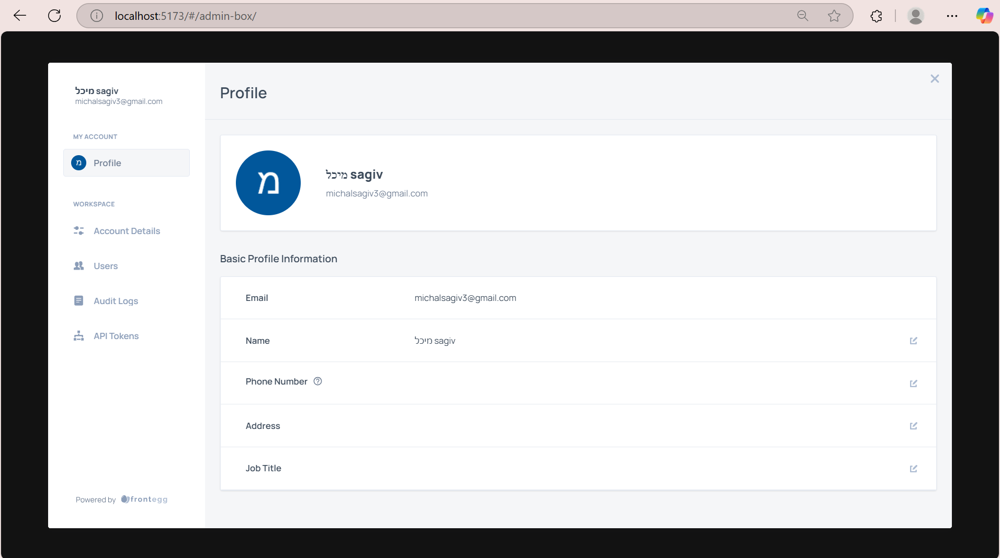

# Frontegg • React + Vite demo

This repository contains my solution for the **Tier-1 Technical Support Engineer** home assignment.  
The application is a minimal Vite + React SPA that demonstrates a basic, working Frontegg integration.

---

## What is implemented

- **Hosted Login Box**  
  - Passwordless magic-link flow  
  - Google social-login button  
- **Sign-up flow** for new tenants (account + company name)  
- **Home page** after authentication  
  - Greets the user by name  
  - Shows the profile picture (or fallback avatar)  
  - Three quick actions: **Show token · Logout · Settings**  
- **Settings → Admin Portal** (opens as a modal inside the SPA)  
  - **Profile** tab  
  - **Users** tab – *vikram.moule@frontegg.com* invited with the custom **Limited Admin** role (magic-link only)  
  - **Audit Logs** tab  
  - **API Tokens** tab (M2M)  
- **Limited Admin** role (view own profile, invite users, view audit logs, create M2M tokens)  
- **Logout** button – clears session and redirects to the App URL  

The entire flow works locally on `http://localhost:5173`.


---

## Visual tour

<table>
  <tr>
    <th>Step</th><th>Screenshot</th>
  </tr>
  <tr>
    <td>Hosted login (sign-in)</td>
    <td></td>
  </tr>
  <tr>
    <td>Hosted sign-up</td>
    <td></td>
  </tr>
  <tr>
    <td>Home page</td>
    <td></td>
  </tr>
  <tr>
    <td>Admin Portal → Profile</td>
    <td></td>
  </tr>
  <tr>
    <td>Admin Portal → Users</td>
    <td></td>
  </tr>
</table>


> All five PNG files are stored in the `images/` directory of the repository.

---

## Running locally

```bash
git clone https://github.com/<your-username>/frontegg-assignment.git
cd frontegg-assignment
npm install
npm run dev         # opens http://localhost:5173
